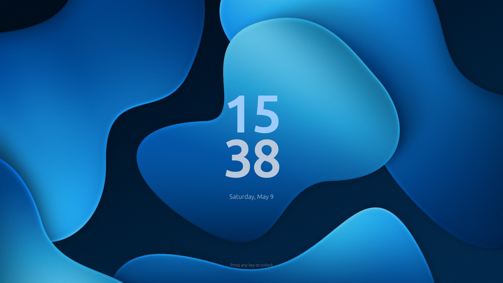
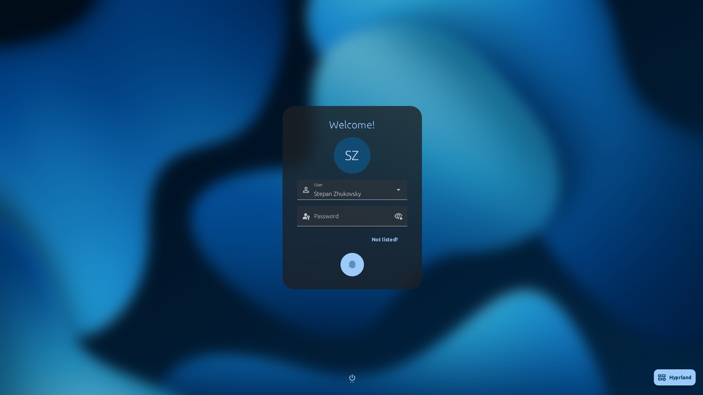
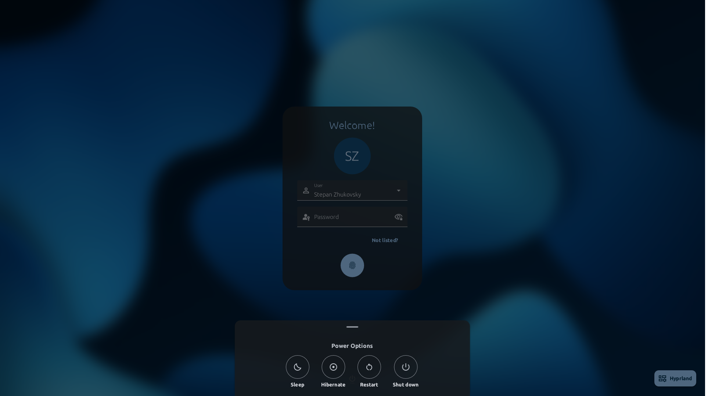

# mdgreet

**A clean Material Design 3 greeter for greetd, built with Rust and Slint.**

mdgreet is a fast, visually appealing, and highly customizable login screen for Linux environments using `greetd`. It leverages the power of Rust for performance and safety, alongside the Slint UI framework to provide a modern, reactive interface based on Material Design 3 guidelines.

## Features

- **Material Design 3:** Adheres to modern design principles, providing a familiar and polished look.
- **Dynamic Theming:** Automatically generate a complete color palette from your chosen wallpaper or a specific seed color.
- **Fast and Lightweight:** Built with Rust, ensuring quick startup times and minimal resource usage.
- **Internationalization (i18n):** Native support for multiple languages.
- **Wayland Native:** Runs perfectly under Wayland compositors like Cage or Sway.

## Interface Preview

*The main screen featuring a clean Material Design 3 clock.*

*The login card with smooth background blur transition.*

*Integrated power management menu.*

